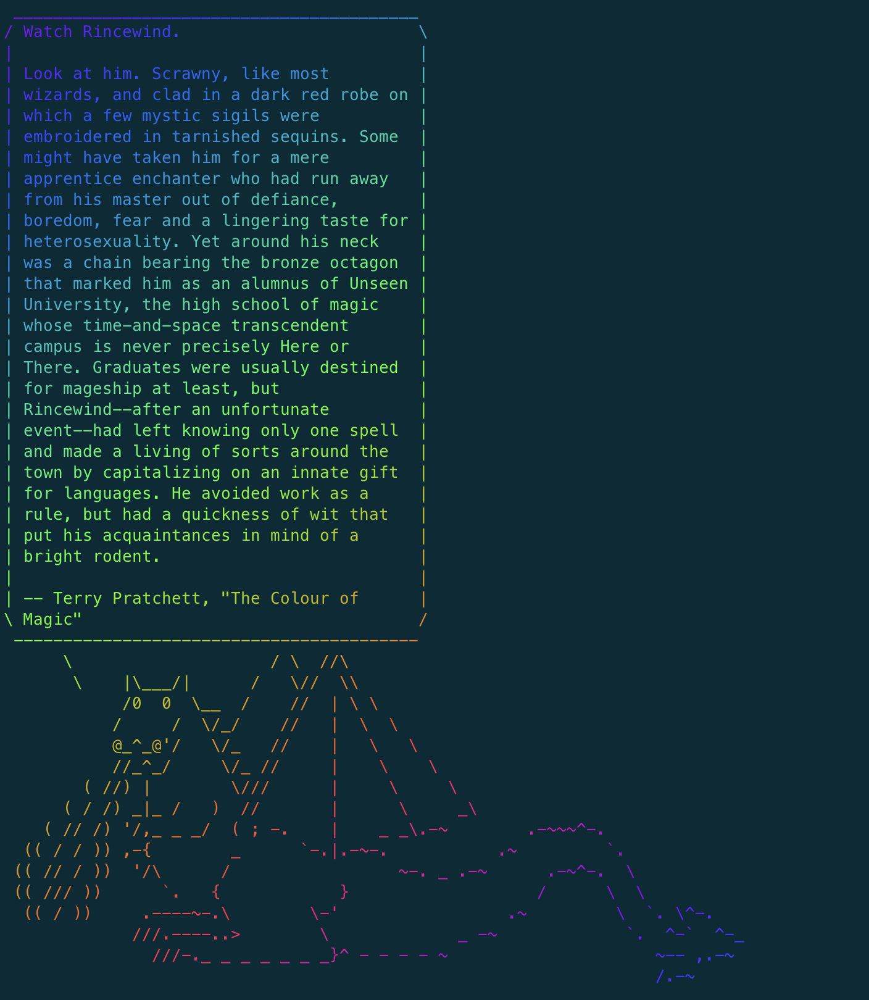

# Terminal {

En ese repositorio veremos algunos conceptos básicos para empezar a utilizar la terminal. Vamos a ver algunos conceptos sobre que es la terminal, para que sirve y cómo funciona. Veremos los comandos más básicos de navegación para iniciar la interación con el ordenador y la sintáxis básica de bash.

---

La terminal es un `interfaz de texto` para introducir instrucciones. Uno de los principales uso que la define es evitar dependencias: rápidas respuestas sobre nuestras consultas.

La terminal es una manera de interactuar con el ordenador, pero en lugar de hacerlo a traves de iconos y movimientos del raton, en lo que conocemos como GUI (Graphical User Interface), se hacen con líneas de comandos. Y por eso la terminal es una CLI (Command Line Interface).

En lo referente a la terminal encontraremos muchos sinónimos de la misma: bash, shell, zsh, iTerm, etc. Aunque cada una tiene sus particularidades, en general nos estaremos refiriendo a lo mismo: emuladores de terminal de tipo Unix-like que usan lenguaje `Bash`.

Bash es el [sexto lenguaje de programación más demandado](https://insights.stackoverflow.com/survey/2020#technology-programming-scripting-and-markup-languages-professional-developers) por los desarrolladores, a día de hoy y posee una buena correlación entre [lenguaje y sueldo](https://insights.stackoverflow.com/survey/2020#top-paying-technologies).

Lo bueno que tiene una terminal es que ya trae consigo gran cantidad de programas y utilidades que aprovecharemos como desarrolladores.

Pero, ¿porqué usar la terminal?. Aquí algunas ideas:

- Indispensable si queremos usar [Git](https://git-scm.com/).
- Esencial para tecnologías CLOUD.
- Una vez que aprendes a usarlo, es más rápido que el ratón.
- Parecemos más hackerman/hackerwoman.
- Hacer cosas chulas como:

```bash
fortune | cowsay -f dragon | lolcat
```



## El prompt

`Punto de entrada al terminal` para introducir comando. Básicamente es la manera que tiene el ordenador de decirnos que está escuchando y aguarda nuestra siguiente orden. La información contenida en general es:

- Nombre del Ordenador
- Nombre de usuario
- Directorio actual
- Signo de prompt

> Es importante saber que en la documentación de internet figura como `$`. Asegúrate de copiar sólo la instrucción (no el símbolo).

> En general, el prompt se representará con uno de esos signos: `$`, `%`, `#`, `:`, `>` o `_`, pero puede cambiar según el sistema y como esté configurado. ¡Hay muchas posibilidades de personalización!

Al abrir la terminal, lo primero que veremos será algo parecido a:

```
# En Mac
MacBook-Pro:~ projects$

# En Ubuntu
projects@linux-desktop: ~$

# En Windows cmd.exe (para comparación)
C:\Users\Projects>
```

## Directorio y rutas

El directorio actual en general sale en el prompt, en ese caso es el directorio "`~`".

### **Home ( ~ )**

La virgulilla (`~`), es un nombre especial, un alias (cognombre), que se refiere a la carpeta `home`, o sea, tu carpeta de usuario. En el caso de Windows, vemos toda la dirección ("C:\Users\Projects"). En los demás caso, el mote es más corto.

Para ver las coordenadas exactas del directorio donde estamos, podemos utilizar el primer de los comandos que aprenderemos:

### ➥ pwd

Los programas y comandos en la terminal suelen tener un nombre que significa algo (para facilitarnos la vida), pwd significa `Print Working Directory`, i.e.: Imprime en pantalla el directorio actual (donde estamos trabajando).

La respuesta podrá ser algo similar a:

```bash
/Users/projects
```

### ➥ ls

Para ver todo el contenido del `cwd` (Current Working Directory), i.e.: la carpeta donde estamos, podemos utilizar el comando `ls` (_list_), para listar. Pruébalo.

Obtendremos un resultado como el siguiente:

```
Applications    Downloads       Music
Public          Projects        Desktop
Library         Pictures        Documents
Movies          code
```

En esta lista vemos (_casi_) todas las carpetas y ficheros que tenemos en nuestra carpeta `home`. ¿Por que casi? Porque hay ficheros y carpetas ocultos. Para poder verlos, tenemos que usar más de una opción del comando `ls`.

### ➥ ls + tags

En lugar de usar solo el comando `ls`, vamos a añadirle la opción `a` (_all_). Las opciones siempre van después del comando y con el carácter `-`:

```bash
ls -a
```

Los nombres de ficheros y carpetas ocultos empiezan con `.`.

```
TIP: Si quieres hacer un fichero o carpeta oculto, pon un punto al principio de su nombre.
```

### ➥ cd

Hemos visto como localizarnos y saber que contenido tenemos disponible en esa localidad, pero ¿cómo nos movemos entre los diferentes directorios? Usando el comando `cd` (Change Directory) y el nombre de la carpeta a la cual queremos acceder:

```bash
cd Downloads
```

> Si quieres volver al directorio anterior, puedes utilizar el comando `cd ..` En el lenguaje de la terminal, `..` significa el directorio superior al en que nos encontramos.
>
> A un conjunto de direcciones le llamamos ruta o path. En él, los diferentes directorios en el camino se separan por `/` . Si estamos en la carpeta _Downloads_ (es nuestro _cwd_), podríamos hacer:
>
> `cd ../Music/Beatles`
>
> Con ello podríamos salir de _Downloads_, entrar en _Music_ y dentro de ese, entrar en _Beatles_.

## Arguments

Al hacer `cd`, le tenemos que decir un path a un directorio. Pero al contrario de lo que hemos visto anteriormente, eso no es una opción. Es un argumento que se pasa al comando (o programa).

De manera general todos los comandos en la terminal van a seguir la misma forma:

```bash
command [ --options ] [Arguments]
```

Los argumentos son valores exteriores que pasamos al programa: pueden ser directorios, ficheros, números, palabras o cualquier otro tipo de dato. ¡Los diferentes argumentos siempre se separan por espacios! Así que si tu argumento contiene un espacio, debes utilizar comillas o usar la `\` para _escapar_ el espacio.

> Algunas veces los argumentos necesitan que se indique a que parámetro se asocia, en ese caso, debemos ponerlo después de una opción, por ejemplo:

```
convert help.wav --format mp3 --output help.mp3
```

## Options

Son algunos de los parámetros que podemos seleccionar en un programa. Pueden presentarse como una única letra con `-` o en un formato más largo con `--`.

```
-a -l -s --verbose --update-server
```

En el caso de las opciones (también llamadas `flags`) que son letras individuales, se pueden combinar en secuencia, eso es, los dos comandos abajo funcionan exactamente igual:

```
ls -a -l
ls -al
```

### Command

Es cualquier programa que esté disponible en el CLI. Además de los que vienen por defecto, puedes instalar los que necesites e incluso escribir tus propios programas para la terminal.

## Ayuda y manual

Pero ¿cómo podremos saber todas las opciones y argumentos que podemos o tenemos que pasar a un comando? La verdad es que, aunque los que más usamos se fijan en la memoria, muchas veces necesitamos un recordatorio. Y no hace falta ni siquiera salir de la terminal. La mayor parte de los programas acepta un flag de ayuda `-h` o `--help`.

Prueba `vi -h` para ver la ayuda de VIM, el editor de texto por defecto en terminales Unix. Sobre todo en las páginas de ayuda es útil la sección _usage_ al principio que te resume como tienes que usar a ese programa. Otra posibilidad, más extensa y con más información es mirar el manual del programa. Eso no se hace con un _flag_, sino que con un comando propio:

```
man vi
```

## Creando y borrando

Además de navegar por los diferentes ficheros y directorios de nuestro ordenador, queremos ser capaces de hacerle cambios. Abajo tenemos algunos comandos básicos que podéis investigar.

### ➥ mkdir

Ese es el comando `make directory`, que nos permite crear una carpeta nueva vacía. Lo único que necesitamos es pasarle como argumento el nombre o path de la carpeta que queremos crear.

`mkdir code/projects/rest_api`

### ➥ touch

El comando `touch` es similar al anterior, pero en lugar de crear un directorio, crea un fichero vacío.

`touch index.html`

### ➥ cat

Ese comando que recibe su nombre de la palabra `concatenate`, lo que hace es enseñarnos el contenido de un fichero.

`cat index.html`

Hay comandos similares que podemos investigar, como el `head` y el `tail`, que nos enseñan el principio y el final del contenido de un fichero respectivamente.

### ➥ rm

El comando `remove` hace exactamente lo que dice, nos borra un fichero o una carpeta. La diferencia es que para borrar un directorio necesitamos añadir el flag `-r`, de `recursive`.

`rm index.html`

`rm -r code/projects/rest_api`

> WARNING: El comando `rm` **no** te hace una pregunta de confirmación y es un proceso sin vuelta. Ten cuidado al usarlo para no borrar cosas importantes.

## TIPS and TRICKS

La practica y fluidez en el uso de la `CLI` viene con la práctica, pero hay muchos tips que podemos utilizar para facilitar y ahorrar tiempo.

### Cycle commands

La terminal guarda un histórico de los comandos que ejecutaste, si quieres volver a encontrar un comando, puede navegarles utilizando las flechas `↑ ↓` También puedes verles como un listado usando el comando `history`.

### bck-i-search

Si no te acuerdas completamente del comando o hace mucho que lo usaste, puedes hacer una búsqueda. Pulsa `Ctrl + r` y empieza a escribir cualquier parte del comando.

### Auto complete

En general, las terminales permiten el uso del `TAB`, `↹`, para auto-completar los comandos, nombres de directorios y ficheros. De esa manera con pocos caracteres y el uso del tab ya tenemos todo listo!

## Customiza!

Hay muchas maneras de customizar la terminal, no solo para dejarla más bonita, sino como para facilitar el trabajo. Si usas macOS, puedes instalar `iTerm2` como alternativa a la terminal por defecto. Se agradece el cambio, pues te dará más posibilidades de configuración. Si tienes Linux, aunque haya alternativas, la terminal por defecto es super! En Windows, tendrás que buscar una de las alternativas citadas anteriormente para tener una terminal bash o zsh.

Uno de los frameworks más populares es Oh My Zsh, con muchos plugins y muchos temas, el más popular es el `agnoster`, aunque otro genial (y mi favorito) es el `Powerleve10k`, que tiene muchas configuraciones. También quizás queráis mirar Hyper, una alternativa a la terminal completamente customizable con HTML y CSS.

Investiga los ficheros de configuración (`.zshrc` y `.bashrc`). Con ayuda de internet podrás descubrir cada vez más posibilidades: si se te ocurre algo, lo más probable es que lo haya pasado a alguien antes y habrá recursos en internet.

## Comandos terminal

Vamos a ver a continuación los comandos que más emplearemos a lo largo del bootcamp. Existen muchos, pero los más destacados son:

- `pwd`: Ver en que carpeta esta la terminal
- `ls`: Listar ficheros en el directorio actual
  - `ls -a`: Lista todos los archivos (incluídos los ocultos)
  - `ls -als`: Lista los ficheros en modo listado
  - `ls -alh`: Lista los ficheros en modo listado con información de tamaño
  - `ls -alsh`: Lista los ficheros en modo listado y con los tamaños de fichero legibles en `kb/mb/etc`
- `ls <nombre_carpeta>`: Lista los elementos de la carpeta (sin entrar en ella)
- `cd`: Navegar entre directorios
  - `cd ../..`: Sube al directorio padre del padre
  - `cd ..`: Sube al directorio padre
  - `cd <nombre_carpeta>`: Ir a la carpeta <nombre_carpeta>
  - `cd ./<nombre_carpeta>`: El ./ señala la propia carpeta en la que nos encontramos (normalmente no se pone)
- `cp -r <nobre_carpeta> <nueva_carpeta>`: copy project
- `mv archivo.txt <nombre_carpeta>`: mover archivos
- `mv archivo.txt mi_archivo.txt`: renombrar archivo
- `touch <nombre_fichero>`: Crea un archivo de texto en blanco
- `code .`: Abre visual studio code en la carpeta actual
- `open .`: Abre la carpeta actual
- `clear`: Limpia la teminal (CMD+K)
- `control+c`: Nuevo prompt para escribir
- `mkdir`: Crea una carpeta vacia
- `rm`: 🚧Elimina un fichero🚧
  - `rm -rf`: 🚧Elimina una carpeta y sus ficheros🚧

```bash
 _________________________________________________________
< Any fool can write code that a computer can understand.
  Good programmers write code that humans can understand. >
 ---------------------------------------------------------
        \   ^__^
         \  (oo)\_______
            (__)\       )\/\
                ||----w |
                ||     ||
```

## Object lesson

Vamos a ejecutar una serie de comandos para crear y editar un fichero de manera rápida desde la terminal. Sigue los siguientes pasos:

```bash
# Crea un directorio nuevo
mkdir demo
# Accede al nuevo directorio
cd demo
# Crea un nuevo fichero
touch file.txt
# Añade información al nuevo fichero desde la terminal
echo "hello world" > file.txt
# Abre el nuevo fichero con el editor de textos
open file.txt
# Abre el nuevo fichero con el editor de textos Nano
nano file.txt
# Accede a la información del nuevo fichero
cat file.txt
# Borra el nuevo fichero
rm -rf file.txt
# Crea una página web desde la terminal
touch index.html
echo '<h1>Hello world</h1>' > index.html
open ./index.html
# Mejora la página web
nano index.html
<div>
<h1>Hello world</h1>
</div>
<div>
<p>This is my first web site</p>
</div>
<div>
<p>I hope one day I will be worth millions</p>
</div>
open index.html
```

## Recursos adicionales

- [Oh My ZSH (macOS y Linux)](https://github.com/ohmyzsh/ohmyzsh)
- [Oh My Zsh (Ubuntu, alternativa)](https://geekytheory.com/como-instalar-oh-my-zsh-en-ubuntu)
- [Oh My Zsh (Windows)](https://medium.com/@lemmusm/cool-windows-terminal-with-oh-my-zsh-8d2c1c759805)
- [espeak](http://espeak.sourceforge.net/)
- [Windows Subsystem for Linux](https://docs.microsoft.com/en-us/windows/wsl/install-win10)
- [Git Bash](https://gitforwindows.org/)
- [Powerlevel10k](https://github.com/romkatv/powerlevel10k)
- [fortune, cowsay, lolcat](https://gist.github.com/zlorb/4a3eff8981fcec8ca1c7)
- [ImageMagick](https://imagemagick.org/script/download.php)
- [htop](https://htop.dev/)
- [Speedtest](https://www.speedtest.net/apps/cli)
- [youtube-dl](https://github.com/ytdl-org/youtube-dl/)
- [w3m](http://w3m.sourceforge.net/)
- [iTerm2](https://iterm2.com/)
- [iTerm color schemes](https://iterm2colorschemes.com/)
- [Hyper](https://hyper.is/)
- [Gnome Terminal (Linux) color schemes](https://www.linuxuprising.com/2019/07/179-color-schemes-for-your-gtk-based.html)
